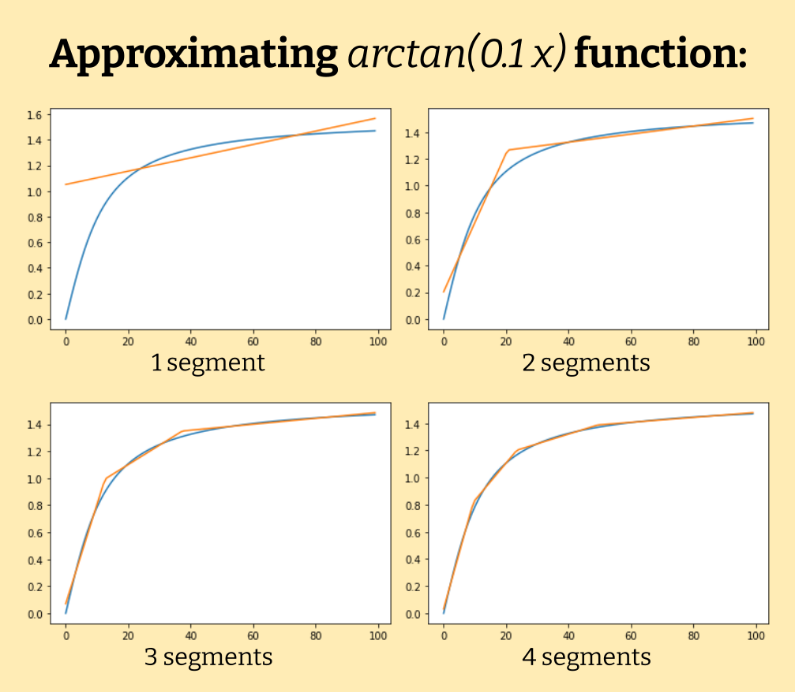

# Piecewise Linear Regression Using a Mixed Integer Linear Program

In this project, I attempted to build and solve a MILP (Mixed Integer Linear Program) for approximating a function with piecewise linear regression. The program minimizes the average absolute deviation (not the mean squared error) by changing both segment borders and their linear approximations. 

_Daniyar Akizhanov_